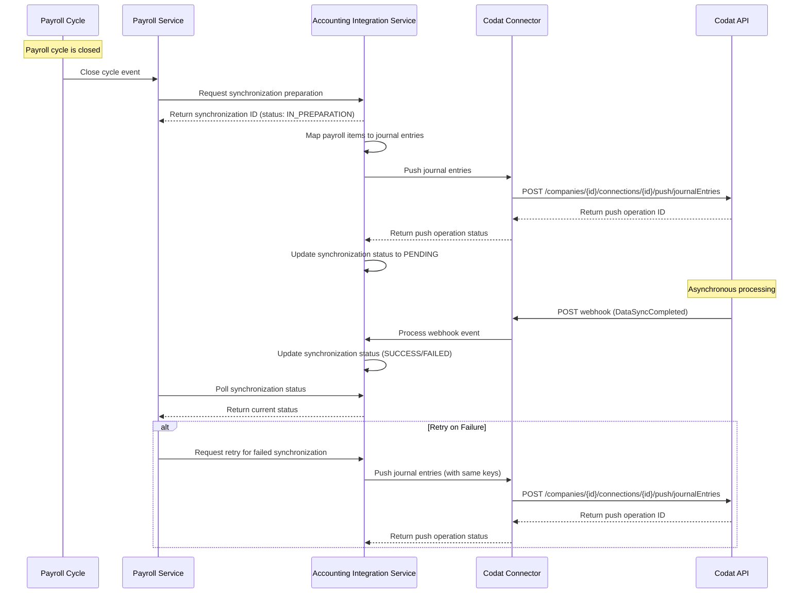

# Technical Guide: Payroll-Codat Integration

## Table of Contents
- [Architecture](#architecture)
  - [Components](#components)
  - [Sequence Diagram](#sequence-diagram)
- [Configuration](#configuration)
  - [Environment Variables](#environment-variables)
  - [Secret Management](#secret-management)
  - [Multi-company/Legal Entity Support](#multi-companylegal-entity-support)
- [Mapping](#mapping)
  - [Data Transformation Layers](#data-transformation-layers)
  - [Chart of Accounts Mapping](#chart-of-accounts-mapping)
  - [Payroll Items to Codat Objects](#payroll-items-to-codat-objects)
  - [Special Rules](#special-rules)
- [APIs & Events](#apis--events)
  - [Codat Endpoints](#codat-endpoints)
  - [Request/Response Examples](#requestresponse-examples)
  - [Rate Limiting & Retry Strategy](#rate-limiting--retry-strategy)
  - [Idempotency](#idempotency)
  - [Webhooks](#webhooks)
- [Error Handling](#error-handling)
  - [HTTP Error Codes](#http-error-codes)
  - [Codat-specific Errors](#codat-specific-errors)
  - [Partial Success Handling](#partial-success-handling)
  - [Dead-Letter Queues](#dead-letter-queues)
  - [Observability](#observability)
- [Testing](#testing)
  - [Unit Testing](#unit-testing)
  - [Contract Testing](#contract-testing)
  - [Integration Testing](#integration-testing)
  - [Sandbox Environment](#sandbox-environment)
  - [End-to-End Test Cases](#end-to-end-test-cases)
- [Security & Compliance](#security--compliance)
  - [PII Masking](#pii-masking)
  - [Role-Based Access](#role-based-access)
  - [Data Retention](#data-retention)
- [Runbook](#runbook)

## Architecture

### Components

The Payroll-Codat integration consists of three main components that work together to synchronize payroll data with accounting systems:

#### 1. Payroll Service

The Payroll Service is responsible for:
- Managing payroll cycles (creation, calculation, approval, and closure)
- Storing employee salary and compensation data
- Handling payroll-specific business logic
- Triggering synchronization with accounting systems when a payroll cycle is closed
- Tracking synchronization status via the `PayrollAccountingSynchronizationProvider` interface

Key classes:
- `com.bayzat.payroll.payrun.manager.PayRunCycleManager`: Manages payroll cycle operations
- `com.bayzat.payroll.accounting.service.PayrollAccountingSynchronizationProvider`: Interface that defines synchronization methods

#### 2. Accounting Integration Service

The Accounting Integration Service serves as the middleware between Payroll and Codat:
- Handles accounting-specific data transformations and business logic
- Maps payroll data to accounting journal entries
- Manages synchronization state and status tracking
- Provides APIs for preparing, starting, and confirming synchronizations

Key classes:
- `com.bayzat.accounting.manager.service.synchronization.AccountingSynchronizationService`: Core synchronization management
- `com.bayzat.accounting.manager.service.codat.AccountingCodatJournalEntryService`: Journal entry creation and submission
- `com.bayzat.accounting.manager.AccountingSynchronizationManager`: Orchestrates the synchronization process

#### 3. Codat Connector

The Codat Connector is responsible for direct communication with the Codat API:
- Manages API authentication and connection status
- Handles API requests and responses
- Processes webhook callbacks from Codat
- Provides services for specific Codat endpoints (journals, accounts, etc.)

Key classes:
- `com.bayzat.accounting.manager.service.codat.AccountingCodatConnectionService`: Manages connections to Codat
- `com.bayzat.accounting.manager.service.codat.AccountingCodatCompanyService`: Company establishment and management
- `com.bayzat.accounting.manager.service.codat.AccountingCodatJournalService`: Journal operations
- `com.bayzat.accounting.queue.consumer.AccountingWebHookEventConsumer`: Processes webhook events

### Sequence Diagram



## Configuration

### Environment Variables

The Payroll-Codat integration relies on the following environment variables:

```yaml
accounting-integration:
  codat:
    api-url: 'https://api.codat.io'  # Codat API base URL
    auth-key: ~  # Codat API authentication key (set via app-conf)
```

These variables are defined in the application configuration files:
- `/bayzat-backend/core/src/main/resources/config/application-base.yml`

### Secret Management

Sensitive configuration values like API keys are not stored directly in source code or configuration files. Instead:

1. The placeholder values (`~`) in configuration files are replaced at runtime with actual values from:
   - Environment variables
   - Secret management services
   - Configuration service

2. For local development, developers can set these values in:
   - `application-local.yml`
   - Environment-specific files that are gitignored

3. For production deployments, secrets are managed using:
   - AWS Secrets Manager
   - Environment variables injected via the deployment pipeline

### Multi-company/Legal Entity Support

The integration supports multiple companies with different accounting systems:

1. **Company Isolation**: Each company has a separate Codat company ID and connection
   - `AccountingCodatCompany` entity stores the mapping between Bayzat company IDs and Codat company IDs

2. **Configuration per Company**: 
   - Each company can have distinct chart of accounts mappings
   - `AccountingBaseConfiguration` entity stores company-specific settings

3. **Legal Entity Support**:
   - For companies with multiple legal entities, each entity can be set up as a separate Codat company
   - The system supports mapping payroll cycles to the appropriate legal entity for accounting purposes

## Mapping

### Data Transformation Layers

The Payroll-Codat integration uses a three-layer data transformation process to convert payroll data into accounting journal entries:

1. **Raw Data Layer** (`AccountingSynchronizationRawData`):
   - Captures the original payroll transaction data as a snapshot
   - Preserves employee details, pay items, amounts, and metadata
   - Serves as an immutable record of the payroll data at synchronization time
   - Allows for reprocessing and audit without fetching data again from payroll service

2. **Raw Data Account Layer** (`AccountingSynchronizationRawDataAccount`):
   - Maps payroll items to specific accounting accounts based on configuration
   - Groups transactions by account, cost center, and other criteria
   - Handles currency conversion using configured exchange rates
   - Separates positive (credit) and negative (debit) effects

3. **Journal Line Layer**:
   - Converts the mapped accounts into Codat-compatible journal entries
   - Applies accounting-specific formatting and rules
   - Creates balanced debit and credit entries
   - Generates the final payload sent to Codat API

### Chart of Accounts Mapping

The integration allows mapping between payroll items and accounting chart of accounts:

1. **Account Structure**:
   - Each payroll item type can be mapped to a specific account ID in the accounting system
   - Accounts are retrieved from Codat via `AccountingCodatAccountService`

2. **Mapping Configuration**:
   - Admins can configure which payroll item maps to which accounting account
   - Mappings are stored in database tables and loaded when synchronization begins

3. **Default Mappings**:
   - The system provides sensible defaults based on common accounting practices
   - These can be overridden by company-specific configurations

### Payroll Items to Codat Objects

Payroll data is transformed into Codat journal entries with the following mapping logic:

1. **Journal Entry Creation**:
   - Each payroll cycle generates one or more journal entries
   - Journal entries contain multiple journal lines for different payroll components

2. **Journal Lines**:
   - Basic salary: Mapped to salary expense and liability accounts
   - Allowances: Mapped to specific allowance expense accounts
   - Deductions: Mapped to liability accounts
   - Taxes/GOSI: Mapped to tax liability accounts

3. **Metadata**:
   - `description`: Contains payroll cycle information
   - `postedOn`: Payroll cycle closing date
   - `journalRef`: For MS Dynamics integration, references specific journals

### Special Rules

1. **Taxes/GOSI Handling**:
   - Government contributions are mapped to specific tax liability accounts
   - Employer and employee portions are separated into different journal lines

2. **Gross/Net Calculation**:
   - System handles both gross-to-net and net-to-gross payroll calculations
   - For net-to-gross, the calculated gross amount is used in journal entries

3. **Rounding Rules**:
   - Currency amounts are handled with proper decimal precision
   - Rounding differences are allocated to a special rounding adjustment account
   - System ensures debits and credits balance exactly

4. **Currency Handling**:
   - Multi-currency support for companies operating in multiple regions
   - Exchange rates can be configured via `AccountingCurrencyExchangeRateService`

## APIs & Events

### Codat Endpoints

The integration uses the following Codat API endpoints:

1. **Company Management**:
   - `POST /companies`: Create a new company in Codat
   - `GET /companies/{companyId}`: Retrieve company details

2. **Connection Management**:
   - `GET /companies/{companyId}/connections`: List all connections
   - `GET /companies/{companyId}/connections/{connectionId}`: Get connection details

3. **Data Pushing**:
   - `POST /companies/{companyId}/connections/{connectionId}/push/journalEntries`: Push journal entries
   - `GET /companies/{companyId}/push/{pushOperationKey}`: Check push operation status

4. **Reference Data**:
   - `GET /companies/{companyId}/data/journals`: Get journals
   - `GET /companies/{companyId}/data/accounts`: Get chart of accounts

### Request/Response Examples

**Example: Push Journal Entry Request**

```json
POST /companies/123456/connections/789012/push/journalEntries

{
  "postedOn": "2023-12-31T00:00:00Z",
  "journalRef": {
    "id": "PAYROLL-JNL",
    "name": "Payroll Journal"
  },
  "journalLines": [
    {
      "description": "December 2023 Salaries",
      "netAmount": 50000.00,
      "currency": "AED",
      "accountRef": {
        "id": "5001",
        "name": "Salary Expense"
      },
      "tracking": {
        "recordRefs": [
          {
            "id": "HR-DEPT",
            "dataType": "trackingCategories"
          }
        ]
      }
    },
    {
      "description": "December 2023 Salaries - Liability",
      "netAmount": -50000.00,
      "currency": "AED",
      "accountRef": {
        "id": "2001",
        "name": "Salaries Payable"
      }
    }
  ],
  "description": "Payroll Journal Entry - December 2023"
}
```

**Example: Push Journal Entry Response**

```json
{
  "changes": [],
  "companyId": "123456",
  "completedOnUtc": "2023-12-31T12:34:56.789Z",
  "data": {
    "id": "JNL-123",
    "postedOn": "2023-12-31T00:00:00Z",
    "createdOn": "2023-12-31T12:34:56.789Z",
    "updatedOn": "2023-12-31T12:34:56.789Z"
  },
  "dataType": "journalEntries",
  "pushOperationKey": "operation-987654321",
  "requestedOnUtc": "2023-12-31T12:34:45.678Z",
  "status": "Success",
  "statusCode": 200,
  "timeoutInMinutes": 5,
  "validationStatus": "Valid"
}
```

### Rate Limiting & Retry Strategy

1. **Rate Limits**:
   - Codat imposes rate limits on API requests
   - Default: 120 requests per minute
   - Rate limit headers are monitored in responses

2. **Retry Strategy**:
   - Exponential backoff is implemented for failed requests
   - Initial retry after 1 second, doubling up to 32 seconds
   - Maximum 5 retry attempts before failing permanently

3. **Backoff Implementation**:
   - System uses queue delays to implement backoff
   - `AccountingPushJournalEntryConsumer` manages the retry logic
   - Failed attempts are logged and monitored

### Idempotency

Idempotency is ensured through several mechanisms:

1. **Journal Entry Identification**:
   - Each journal entry has a unique identifier based on payroll cycle ID
   - Retrying the same synchronization won't create duplicate entries

2. **Push Operation Tracking**:
   - `journalEntry.pushedAt` timestamp indicates when an entry was pushed
   - System checks this before attempting to push entries

3. **Codat Operation Keys**:
   - Push operation keys from Codat are stored and can be used to check status
   - Prevents duplicate processing of webhook callbacks

### Webhooks

Codat sends webhooks to notify about asynchronous processing:

1. **Webhook Endpoint**:
   - The system exposes an endpoint for Codat webhooks
   - Events are parsed and published to internal event queue

2. **Event Types**:
   - `DataConnectionStatusChanged`: Connection status changes
   - `DataSyncCompleted`: Data synchronization complete
   - `DatasetDataChanged`: Dataset data has changed

3. **Signature Validation**:
   - Webhook payloads include signatures for authenticity verification
   - System validates signatures before processing events

4. **Event Processing**:
   - `AccountingWebHookEventConsumer` processes webhook events
   - Updates synchronization status based on webhook data

## Error Handling

### HTTP Error Codes

The integration handles various HTTP error codes from Codat:

| Code | Description | Handling |
|------|-------------|----------|
| 401 | Unauthorized | Re-authentication attempt, alert if persistent |
| 403 | Forbidden | Log error, notify administrators |
| 404 | Not Found | Check configuration, entity existence |
| 422 | Validation Error | Parse validation errors, log details |
| 429 | Rate Limited | Implement backoff, retry with delay |
| 5xx | Server Error | Retry with exponential backoff |

### Codat-specific Errors

In addition to standard HTTP errors, the system handles Codat-specific error types:

1. **Authentication Errors**:
   - Handled by `CodatConnectionException`
   - Triggers alerts for API key issues

2. **Validation Errors**:
   - Detailed validation errors in response bodies
   - Parsed by `ErrorResponseMapper` for structured handling

3. **Platform-specific Errors**:
   - MS Dynamics requires journal reference (`AccountingMsDynamicsIntegrationMustHaveJournalException`)
   - Different accounting platforms have specific error handling

### Partial Success Handling

For batch operations or complex synchronizations:

1. **Transaction Integrity**:
   - Database transactions ensure all-or-nothing updates
   - `@Transactional` annotations manage transaction boundaries

2. **Partial Failures**:
   - If some entries succeed but others fail, system can retry failed entries only
   - Status tracking at the individual entry level

3. **Manual Intervention**:
   - UI allows administrators to review and retry failed entries
   - Detailed error information guides manual fixes

### Dead-Letter Queues

Failed events are handled through dead-letter queues:

1. **Event Routing**:
   - Failed processing after retry attempts goes to dead-letter queue
   - Events in dead-letter queue can be reviewed and reprocessed

2. **Queue Configuration**:
   - SQS maximum receive count: 10 (from configuration)
   - After 10 failed attempts, message moves to dead-letter queue

3. **Monitoring**:
   - Alerts on dead-letter queue buildup
   - Dashboard for dead-letter queue statistics

### Observability

The integration includes comprehensive observability features:

1. **Logging**:
   - Detailed logs with `#ACCOUNTING#` prefix for easy filtering
   - Request/response logging for debugging
   - Error details captured with stack traces

2. **Metrics**:
   - Synchronization attempts and success rates
   - API call durations and error counts
   - Queue processing metrics

3. **Tracing**:
   - Transaction IDs flow through the entire process
   - Distributed tracing across services

4. **Alerts**:
   - Alert on multiple failed synchronizations
   - Alert on webhook processing failures
   - Alert on Codat connection issues

## Testing

### Unit Testing

Unit tests focus on the core business logic:

1. **Service Tests**:
   - `AccountingSynchronizationServiceTest`: Tests synchronization logic
   - `AccountingCodatJournalEntryServiceTest`: Tests journal entry creation

2. **Mapping Tests**:
   - Test payroll item to journal entry mapping
   - Verify currency handling and rounding

3. **Error Handling Tests**:
   - Test behavior with various error conditions
   - Verify retry and backoff logic

### Contract Testing

Contract tests ensure API compatibility:

1. **Codat API Contracts**:
   - Tests against Codat API contract specifications
   - Validates request/response structures

2. **Internal Service Contracts**:
   - Tests between Payroll and Accounting Integration Service
   - Ensures `PayrollAccountingSynchronizationProvider` contract is honored

### Integration Testing

Integration tests verify end-to-end flows:

1. **Service Integration**:
   - `AccountingCodatConnectionServiceIntegrationTest`: Tests connection management
   - `AccountingCodatCompanyManagerIntegrationTest`: Tests company management

2. **Event Flow**:
   - Test event production and consumption
   - Verify webhook handling

3. **Database Integration**:
   - Test persistence operations
   - Verify transaction boundaries

### Sandbox Environment

A sandbox environment is available for testing:

1. **Codat Sandbox**:
   - Dedicated Codat sandbox environment
   - Mimics production behavior without affecting real accounting systems

2. **Test Datasets**:
   - Pre-configured test companies
   - Sample chart of accounts
   - Test connection configurations

3. **Environment Configuration**:
   - Separate configuration for sandbox testing
   - Isolated from production data

### End-to-End Test Cases

Key test scenarios include:

1. **Happy Path**:
   - Complete payroll cycle synchronization
   - Verify journal entries in accounting system
   - Check balance validation

2. **Edge Cases**:
   - Large payroll with many entries
   - Multi-currency payroll
   - Special tax scenarios

3. **Error Scenarios**:
   - Connection failure handling
   - Rate limit handling
   - Validation error recovery

## Security & Compliance

### PII Masking

Personal Identifiable Information (PII) is protected:

1. **Data Minimization**:
   - Only necessary data is sent to Codat
   - Employee names and personal details are not included in journal entries

2. **Aggregation**:
   - Journal entries aggregate employee data by departments or cost centers
   - Individual employee details are not exposed

3. **Logging Protection**:
   - PII is masked in logs using patterns
   - Sensitive data is redacted from API request/response logs

### Role-Based Access

Access to integration features is controlled:

1. **User Roles**:
   - `ACCOUNTING_ADMIN`: Can configure accounting integrations
   - `PAYROLL_ADMIN`: Can initiate synchronizations
   - `ACCOUNTANT`: Can view synchronization status

2. **Permission Checks**:
   - API endpoints enforce permission checks
   - UI elements are conditionally rendered based on permissions

3. **Audit Logging**:
   - All configuration changes are audit-logged
   - Synchronization attempts are tracked with user information

### Data Retention

Data retention policies ensure compliance:

1. **Synchronization Records**:
   - Retained for audit purposes
   - Historical synchronizations available for reference

2. **Webhook Logs**:
   - Stored for troubleshooting
   - Purged after configurable retention period

3. **Journal Entry Data**:
   - Retained according to accounting and tax regulations
   - Archived based on company-specific retention policies

## Runbook

### Common Operations

1. **Setting Up a New Company**
   - Create company in Codat: `POST /companies/{companyId}/accounting/company`
   - Configure chart of accounts mappings
   - Set up cost center mappings if needed

2. **Troubleshooting Failed Synchronizations**
   - Check synchronization status: `GET /companies/{companyId}/pay-run-cycles/{payRunCycleId}/accounting/synchronization`
   - Review error details in logs (search for `#ACCOUNTING#`)
   - Verify Codat connection status: `GET /companies/{companyId}/accounting/connection/status`

3. **Handling Webhook Issues**
   - Check webhook logs in database (`AccountingWebHookLog`)
   - Verify webhook URL configuration in Codat
   - Test webhook delivery with Codat's test feature

4. **Retry Failed Operations**
   - Use admin interface to retry specific failed synchronizations
   - Check dead-letter queue for failed events
   - Reprocess events from dead-letter queue if needed

5. **Monitor Integration Health**
   - Check synchronization success rate metrics
   - Review API error rates and response times
   - Monitor webhook processing metrics